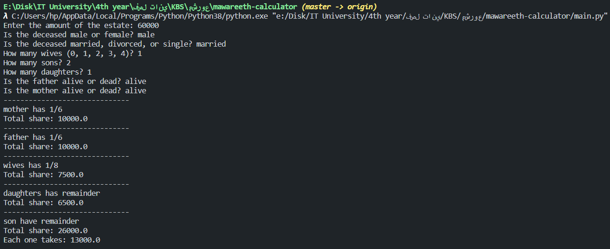

# Mawareeth calculator

A final project for the expert-systems(KBS) course at Damascus University.

## Overview

An expert system project to calculate the Islamic inheritance.
The project covers almost all cases in the Islamic inheritance.

## Technologies

We used python as a programming language and
[Experta](https://pypi.org/project/experta/) library to build the Mawareeth engine.

If you don't have the experta libarary installed then run the following command:
    
    pip install experta

## How to use

Run the following command to run the project:

    python3 main.py

After that, the system will ask you some questions about the deceased.

## Example

## Contributors

- [Abdulrahman Kanakri](https://github.com/abdulrahmanKanakri)
- [Dania Kallajo](https://github.com/Daniaka)
